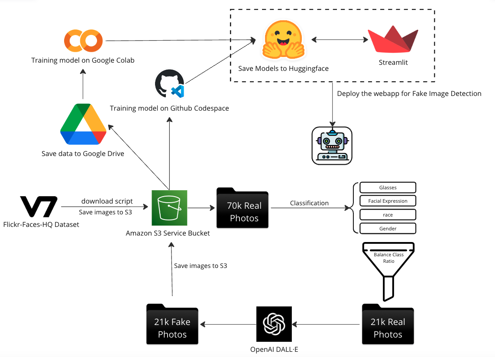
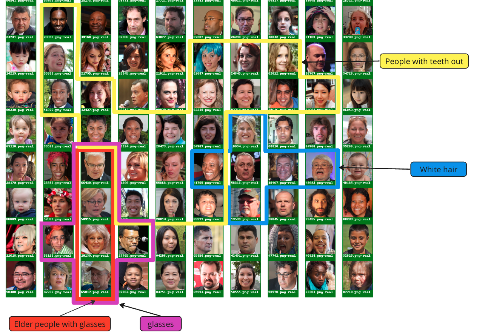

# Detecting AI-Generated Fake Images
This project generates AI images using the DALL-E2 API from OpenAI and use the generate picture to build a AI-Generated Image detector. 

The final [webapp](https://fake-image-generator-detector.streamlit.app/) 
*Note: You will need OpenAI API keys to get access. Read more [how to get Openai API](https://www.windowscentral.com/software-apps/how-to-get-an-openai-api-key) 

Watch [project intro video](https://youtu.be/JuHQ8IRsfYc) to get more information.
## Abstract

With the steady rise in innovative new deep learning techniques, the detection of AI-generated fake images has become a critical research problem. In this project, we aim to apply a convolutional neural network based model to detect a particular kind of fakes - facial images. This idea was developed from previous studies done in this space, including Sabithaa et al. (2020) and Zhang et al. (2020). We use the current state-of-the-art pre-trained ResNet model to address vanishing gradients in deep neural networks, as proposed by He et al. (2016). We also run experiments using the light-weight pre-trained MobileNetV2. Our models are fine-tuned and evaluated using the FFHQ (Flickr-Faces-HQ) dataset as the benchmark. Through our experimentation, we achieve high accuracy in detecting fake images, and analyze the impact of different categories on model performance, obtaining an overall accuracy of 80% with MobileNetV2 and an accuracy of 89% with ResNet50. Our findings can be applied to real-world applications where fake image detection is critical.

## Introduction
Image-generation AI models have made significant progress in recent years, particularly with the advances in neural network techniques. This has led to the development of several impressive models including DALL-E 2 developed by OpenAI. DALL-E 2 is a transformer autoregressive model in which the model learns to map the input text to a latent space representation, which is then used to generate a corresponding image. Thus, DALL-E 2 can be effectively used for fake image generation through textual descriptions. DALL-E 2's ability to generate high-quality images has significant implications for a wide range of applications, including entertainment, advertising, digital art, and even architecture design.
However, the use of AI-generated images raises important questions about the ethical implications of using such images. For example, AI-generated images can be misused to create fake images or videos of individuals, which may potentially lead to serious consequences such as identity theft or reputational harm. For this reason, this project aims to build a machine learning model that can differentiate between AI-generated images created by DALL-E 2 and real human face images. Our project is driven by the potential ethical implications of using AI-generated images in various contexts, such as deep fakes and racial bias. By uncovering valuable insights into these differences, we hope to contribute to this significant area of study and promote ethical practices in the use of AI-generated images.

# install package 
To install the required packages, run the following command:

> make install 

This will install the required packages specified in the requirements.txt file.

# API Key
To use the DALL-E2 API, you will need to obtain an API key from OpenAI. Once you have an API key, create a .env file in the root directory of the project and add the following line:

> touch .env

> OPENAI_API_KEY = "YOUR_OPENAI_API_KEY"

# Usage
- dalle2_code.py: generate AI pic and save it into Google drive. 
- localDalle2.py: Read pic from input folder and generate AI pic and save it into local output folder.
- downloaded-json: Get real human picture from V7. 
- aws_upload.ipynb: upload image into Amazon s3 bucket.
- final_output_mobielnet.ipynb: Train mobileNetv2 model using s3 and codespace
- MobileNetV2_model.py: Train MobileNetV2 model using s3 on Apple M2 GPU
- Resnet.ipynb: Train ResNet50 on Gooogle colab.
- cnn_model.ipynb: Train and test model using huggingface model on local.
- mobileNetV2_visual.ipynb: Visualize MobileNetV2 model.
- resNet_visualization.ipynb & restNet_visual.ipynb: Visualize RestNet50 using UMAP.

## pipeline 

## Methodology 
Our work is intended to build a neural network model to detect fake AI images, based on previous work done including Sabithaa et al. (2020), Zhang et al. (2020), and He et al. (2016). Sabithaa et al. (2020) used an enhanced model for detecting fake images generated by artificial intelligence using convolutional neural networks with histogram and wavelet-based feature extractions. In our study, the real dataset we used is the same as one of their evaluation datasets, FFHQ dataset, which would be a good reference for our model building process. Zhang et al. (2020) also adopted a CNN-based architecture for detecting fake images. We particularly paid attention to He et al. (2016) which proposed the ResNet model developed for addressing the problem of vanishing gradients in deep neural networks. Our study can fine-tune their pre-trained model and visualize outputs to gain insights into the model’s predictions. This visualization would be highly useful to our study, because we aim to achieve high accuracy while understanding the factors influencing detection performance. Based on this research, we will be using ResNet50. We also chose to use MobileNetV2 since it is a lightweight version of ResNet50, and to explore its performance as compared to ResNet50.

## DallE-2 image generator
the code is in AI_generate folder, contains three different way to generate the AI image from DallE-2, local-local, S3-S3, and local-google. 

## Model processing
->  Model_processing & Model_train folder

* MobileNetV2
MobileNetV2 model, as a pre-trained base model for transfer learning, is a deep learning architecture that is designed for mobile devices and has a small computational footprint. The model was trained on the ImageNet dataset, which has over 1 million images with 1000 different classes. The model has been shown to achieve high accuracy on image classification tasks while requiring fewer parameters and computation compared to other popular architectures. We adopted the pre-trained MobileNetV2 model with its weights trained on the ImageNet dataset, and the top layer of the model is excluded by setting include_top to False. This allows us to reuse the feature extraction capabilities of the model while adding our custom classification layer on top.

* ResNet50
We used the ResNet50 model from the library Keras, pre-trained on the ImageNet dataset. We removed the input and output layers and froze the rest of the weights since re-training the whole network would be time-consuming. We then added an input layer of size (180, 180, 3). To the end of the network, we added a Dense layer of size 512 and activation ReLU and an output Dense layer of size 1 and activation Sigmoid, since this is a binary classification problem. We also chose to use the Adam optimizer and Binary Crossentropy as our loss function. We chose our batch size to be 300.

## Visualization
After we train the ResNet50, we deploy the pre-trained Keras model on HuggingFace, and use it for visualization. Here, we cluster and plot the feature maps and their corresponding images from the final layer of ResNet to be able to visualize the model’s predictions.

We see from the below plot that similar images (faces with similar attributes are grouped together) as are the predicted fake or real images. From this we can conclude that the ResNet model learns the attributes of the faces and whether the image is real or fake and this information is encoded in the feature map of the final model layer.

### Dimensionality Reduction
We also tried the images in a lower-dimensional space (2D) obtained by UMAP, which helps in identifying patterns and relations between the images. 

## Deployment 
We upload the model into huggingface and deploy the model use huggingface and streamlit 

* [Fake Image Detection](https://huggingface.co/spaces/Emmawang/Fake_image_detection). To try MobileNetV2 model.

* [AI image generator & Fake image detector](https://fake-image-generator-detector.streamlit.app/). To try AI-image generator and ResNet Fake image detector 

    .
# Contributing
Pull requests are welcome! If you would like to contribute to this project, please fork the repository and create a new branch for your changes. Submit a pull request when you are ready to merge your changes back into the main branch.

# License
This project is licensed under the MIT License - see the LICENSE file for details.